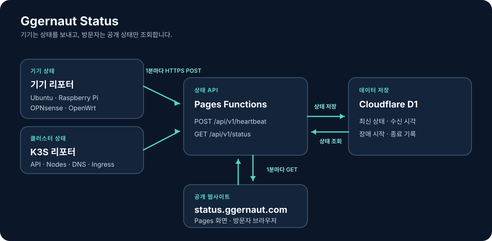

# Ggernaut Status

홈랩 기기와 K3S의 가동 상태를 공개하는 페이지입니다. 화면은 Cloudflare Pages, 상태 API는 Pages Functions, 상태 데이터는 D1을 사용합니다.

| 구성 | 기술 스택 |
| --- | --- |
| 웹 화면 | TypeScript, React, Vite, SWR |
| API | TypeScript, Cloudflare Pages Functions (Workers 런타임) |
| DB | Cloudflare D1 (SQLite 기반) |
| 장비 Reporter | POSIX Shell, curl, systemd/cron |
| 관리 CLI / 인프라 | Node.js / Terraform, Wrangler |

API는 Rust/Axum 서버가 아니라 Cloudflare에서 실행하는 TypeScript 함수입니다.

- 웹사이트: [https://status.ggernaut.com](https://status.ggernaut.com)
- 공개 저장소: [CHO-GGERNAUT/status](https://github.com/CHO-GGERNAUT/status)

## 구조



각 리포터는 1분마다 외부로 HTTPS heartbeat를 보냅니다. 상태 항목은 서로 독립적이며, 마지막 수신 후 180초 동안 새 heartbeat가 없으면 장애로 표시합니다. D1에는 항목별 최신 상태와 장애 시작·종료 기록만 저장하고, 매번 받은 원본 heartbeat나 상세 기기 지표는 보관하지 않습니다.

주요 경로:

- `reporter/`: 기기·K3S 리포터 스크립트와 실행 스케줄
- `functions/`: Cloudflare Pages Functions의 API 진입점
- `src/server/`: 인증, 상태 판정, D1 저장·조회
- `src/web/`: 공개 상태 화면
- `migrations/`: D1 스키마와 상태 항목 초기값
- `infra/cloudflare/`: Pages·D1·도메인 Terraform 설정

## 로컬 개발

Node.js 22.13 이상과 pnpm 9를 사용합니다. API 저장·권한·토큰 테스트는 Node.js 내장 SQLite로 실행합니다.

```bash
pnpm install
pnpm db:migrate:local
pnpm build
pnpm dev
```

로컬 Pages 서버에는 Functions API와 `db:migrate:local`로 초기화한 로컬 D1이 함께 포함됩니다. Wrangler가 출력한 주소로 접속하세요. `pnpm dev:web`은 프런트엔드만 실행하므로 API는 제공하지 않습니다.

전체 검증:

```bash
pnpm check
```

## 리포터 등록 및 설치

리포터 구현·systemd 유닛·라우터 설치 안내·동작 테스트는 이 `status` 레포에서 관리합니다.
`homelab`은 지정된 status 커밋의 리포터를 서버에 설치하고, 장비별 설정과 토큰을 배치합니다.
리포터는 홈랩 장비에서 실행하고 상태 페이지·API·D1은 Cloudflare에서 실행합니다.

관리 Secret은 관리 API 인증에만 사용하고, 각 Reporter는 자신의 별도 토큰으로 heartbeat를 보냅니다.
서버가 토큰을 발급하고 D1에 해시와 권한을 저장하므로 등록 SQL을 만들거나 직접 적용하지 않습니다.
기존에 등록된 Reporter 토큰과 heartbeat API는 그대로 사용할 수 있습니다.

최초 설정은 Wrangler에 로그인한 관리 PC에서 실행합니다. Secret은 난수 32바이트이며
Git 제외 `local/admin.env`에 0600으로 저장됩니다. 평문은 터미널에 출력되지 않습니다.
배포 명령은 해당 값을 Cloudflare **production**의 암호화된 `STATUS_ADMIN_TOKEN` Secret으로 전달합니다.

```bash
pnpm admin:secret:create
pnpm admin:secret:deploy production
# Secret을 사용하는 앱을 배포해야 Functions에 반영됩니다.
```

관리 CLI는 `local/admin.env`의 `STATUS_ADMIN_URL`과 `STATUS_ADMIN_TOKEN`을 읽습니다.
다른 파일은 `STATUS_ADMIN_ENV_FILE`로 지정하고, 환경변수로 덮어쓸 수도 있습니다.
운영·preview는 별도 관리 Secret과 Reporter 토큰을 사용합니다. preview 설정 시 새 파일을 만들고
그 안의 URL을 preview 배포 주소로 변경한 후 `pnpm admin:secret:deploy preview local/admin.preview.env`를 사용합니다.
관리 Secret은 Reporter 장비, 프런트엔드, URL, Git, 로그에 넣지 않습니다.
로컬 개발은 별도 테스트 Secret을 `.dev.vars`에 `STATUS_ADMIN_TOKEN=...`으로 설정하고
관리 CLI URL을 Wrangler의 localhost 주소로 지정합니다. Secret이 없거나 너무 짧으면 관리 API는 503으로 닫힙니다.

관리 PC에서 [감시 항목 예제](reporter/components.example.json)를 참고해 `local/components.json`을 작성합니다.
이름과 설명은 공개 페이지에 표시되므로 내부 IP나 비밀을 넣지 않습니다.

```bash
pnpm component:register local/components.json
pnpm token:create ubuntu-main ubuntu-main-server --output-dir local/ubuntu-main
pnpm token:create k3s-main k3s-api k3s-nodes k3s-dns k3s-ingress --output-dir local/k3s-main
```

이 명령은 **즉시 원격 API를 호출하여 D1을 변경**합니다. 대상 URL을 확인하세요.
감시 항목 재등록은 ID·감시 시작 시각·상태·장애 이력을 유지합니다. 기존 활성 여부는 `enabled`를
명시할 때만 바뀝니다. 생략한 설명·대기 시간·정렬 순서는 기본값으로 설정하는 PUT 방식입니다.
Reporter의 모든 감시 항목은 먼저 등록되고 활성화돼 있어야 하며, 같은 Reporter ID를 다시 생성하면 409입니다.
`--output-dir`은 필수이고 새 디렉터리에 `token.env`만 저장합니다. 디렉터리는 0700, 파일은 0600이며
기존 경로는 덮어쓰지 않습니다. API 응답에서 발급한 평문 토큰은 다시 조회할 수 없습니다.
보고 대상 기기에는 Node.js가 필요 없고 `token.env`의 값을 Ansible Vault 또는 root 전용 설정으로 전달합니다.

권한/이름/활성 여부 수정은 `local/update.json`에 `{ "components": ["ubuntu-main-server"], "enabled": true }`처럼 작성합니다.
수정은 토큰과 sequence를 유지합니다. `{ "enabled": false }`는 Reporter의 보고를 차단합니다.

```bash
pnpm reporter:update ubuntu-main local/update.json
pnpm token:rotate ubuntu-main --output-dir local/ubuntu-main-rotated
```

재발급은 즉시 이전 토큰을 폐기하고 sequence를 초기화하며 권한·활성 여부·장애 이력을 유지합니다.
새 토큰을 장비에 반영할 때까지 기존 Reporter의 전송은 401이 됩니다.
시간 초과처럼 요청 결과가 불확실한 경우 무작정 생성/재발급을 반복하지 말고 서버 상태를 확인하세요.

| 관리 API | 동작 |
| --- | --- |
| `PUT /api/v1/admin/components` | 감시 항목 배열 등록/설정 |
| `POST /api/v1/admin/reporters` | `{ id, name?, components }`로 생성, `{ reporterId, token }` 반환 |
| `PATCH /api/v1/admin/reporters/:id` | `{ name?, enabled?, components? }` 수정 |
| `POST /api/v1/admin/reporters/:id/token` | 토큰 재발급, `{ reporterId, token }` 반환 |

관리 API는 HTTPS `Authorization: Bearer <STATUS_ADMIN_TOKEN>`으로 인증하고 응답을 `no-store`로 반환합니다.
일반 Reporter 토큰으로 관리 API를 호출하거나 관리 Secret으로 heartbeat를 보낼 수 없습니다.
Secret의 최초 설정/교체에는 Cloudflare 권한이 필요하지만 이후 장비 등록에는 관리 API 인증만 필요합니다.

Linux 설치는 [homelab 설정 안내](reporter/ansible.md)를 따릅니다.
관리 PC에 status를 원하는 커밋으로 준비하고 `status_reporter_source_dir`와
`status_reporter_revision`에 경로와 40자리 커밋 SHA를 지정합니다.
Ansible은 리포터 파일이 수정되지 않았고 해당 커밋과 일치하는지 확인한 다음 설치합니다.
아직 커밋하지 않은 리포터 변경은 설치 대상으로 사용할 수 없습니다.

호스트 리포터의 생존 신호는 서버가 실행 중이고 Cloudflare에 연결할 수 있다는 의미입니다.
개별 앱의 정상 동작까지 확인하지 않습니다. K3S 리포터는 서버 노드 한 대에서
API·노드·CoreDNS·Traefik 상태를 독립적으로 확인합니다. DNS·Ingress 검사는 준비된
Deployment 복제본 수를 보며 실제 DNS 질의나 외부 HTTP 라우팅 성공까지 보장하지 않습니다.

수동 Linux 설치, 토큰/전송 오류 확인은 [리포터 운영 안내](reporter/README.md),
OPNsense·OpenWrt는 각각 [OPNsense](reporter/opnsense/README.md)·[OpenWrt](reporter/openwrt/README.md) 안내를 따릅니다.

## Cloudflare 인프라 및 배포

Terraform은 운영·미리보기 D1 데이터베이스, GitHub에 연결된 Pages 프로젝트, 각 환경의 D1 바인딩, `status.ggernaut.com` 사용자 지정 도메인 등록을 관리합니다. Cloudflare에서 도메인을 활성화하려면 별도 DNS 레코드가 `ggernaut-status.pages.dev`를 가리켜야 합니다.

암호화된 관리 Secret은 Wrangler로 별도 설정합니다. Terraform은 환경별 `env_vars` 변경을 무시하여
직접 설정한 Secret을 덮어쓰지 않으며 Secret 평문을 Terraform 설정에 넣지 않습니다.

```bash
cd infra/cloudflare
cp example.tfvars terraform.tfvars
terraform init
terraform plan
terraform apply
```

Terraform 실행 시 셸에 `CLOUDFLARE_API_TOKEN`을 설정합니다. 현재 운영 Terraform 상태는 Git에서 제외된 로컬 파일 `infra/cloudflare/terraform.tfstate`에 있으므로 보존해야 합니다. 다른 컴퓨터에서 Terraform을 사용하기 전에 원격 백엔드로 옮기고, 상태 파일을 절대 커밋하지 마세요.

Pages 프로젝트는 `CHO-GGERNAUT/status`의 `main`을 따라갑니다. push할 때 Cloudflare가 `pnpm check`를 실행하고 `dist`를 배포합니다. 별도의 GitHub Actions 배포나 저장소 API 토큰은 사용하지 않습니다. D1 스키마 변경이 필요한 앱 코드를 push하기 전에는 Wrangler 인증이 완료된 관리 PC에서 두 데이터베이스에 마이그레이션을 적용하세요.

```bash
pnpm db:migrate:preview
pnpm db:migrate:production
```

운영·미리보기 데이터베이스의 초기 마이그레이션은 이미 적용됐습니다. Pages 배포가 D1 마이그레이션을 자동 실행하지는 않습니다. Terraform도 수동 인프라 작업이며 Pages 빌드에 포함되지 않습니다.
